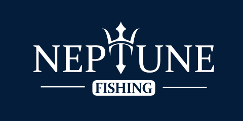
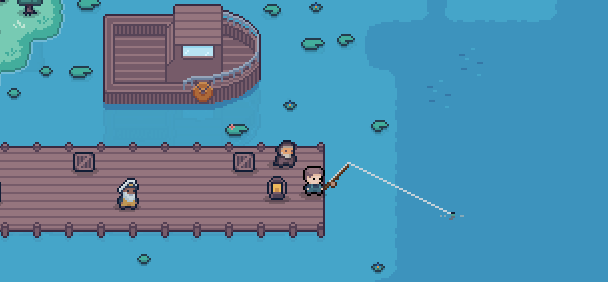

<!-- PROJECT SHIELDS -->
[![Contributors][contributors-shield]][contributors-url]
[![Forks][forks-shield]][forks-url]
[![Stargazers][stars-shield]][stars-url]
[![Issues][issues-shield]][issues-url]
[![MIT License][license-shield]][license-url]

<!-- PROJECT LOGO -->
 

  

  <h3 align="center">Neptune - Fishing Mod</h3>

  

    Neptune is a fishing mod for APICO. It provides a new and interactive way to progress through the game by fishing for interesting and exotic creatures.
     
    <a href="https://github.com/PolarJunction/Neptune"><strong> View on Mod.io »</strong></a>
     
     
    <a href="https://github.com/PolarJunction/Neptune">View Demo</a>
    ·
    <a href="https://github.com/PolarJunction/Neptune/issues">Report Bug</a>
    ·
    <a href="https://github.com/PolarJunction/Neptune/issues">Request Feature</a>
  

<!-- TABLE OF CONTENTS -->

  
<h2 style="display: inline-block">Table of Contents</h2>

  <ol>
    <li>
      <a href="#getting-started">Getting Started</a>
      <ul>
        <li><a href="#Fish">Fish</a></li>
        <li><a href="#Rods">Rods</a></li>
        <li><a href="#Bait">Bait</a></li>
      </ul>
    </li>
    <li><a href="#installation">Installation</a></li>
    <li><a href="#feedback--bug-reporting">Feedback & Bug Reporting</a></li>
    <li><a href="#roadmap">Roadmap</a></li>
    <li><a href="#contributing">Contributing</a></li>
    <li><a href="#license">License</a></li>
    <li><a href="#contact">Contact</a></li>
    <li><a href="#acknowledgements">Acknowledgements</a></li>
  </ol>

  

<!-- GETTING STARTED -->
## Getting Started

To get started with Neptune, speak to Poseidon by the docks. He has a selection of fishing rods for purchase. Each rod is unique and has improved stats over the cheaper rods.
Catch fish by looking around for fishing spots - bubbling areas in the deep water, then casting your line into the fishing spot by clicking with a fishing rod equipped.

### Fish
There are a huge collection of fish and items that can be caught, increase your chances of catching more valuable fish by using a higher quality fishing rod.
Biomes are also important, some fish can only be caught in certain biomes.

### Rods
The higher quality rods have improved stats.
* Better chance to catch fish over junk items
* Fish will bite faster
* Longer time to respond to bites
* Fishing line length increases

### Bait
Some bait is occasionally available for purchase from the vendor on the docks, bait can be thrown in the water to attract fish.
The better quality the bait, the better the chances of attracting fish.

## Installation

This mod can be installed via the APICO Mods Menu, simply download and enable.
A new save is not required for this mod.

## Feedback & Bug Reporting
If you run into an issue, you can report it to me @Polar on the APICO Guilded server.
You can also raise it here under [open issues](https://github.com/PolarJunction/Neptune/issues)

<!-- ROADMAP -->
## Roadmap

See the [open issues](https://github.com/PolarJunction/Neptune/issues) for a list of proposed features (and known issues).

<!-- CONTRIBUTING -->
## Contributing

Contributions are what make the open source community such an amazing place to learn, inspire, and create. Any contributions you make are **greatly appreciated**.

1. Fork the Project
2. Create your Feature Branch (`git checkout -b feature/AmazingFeature`)
3. Commit your Changes (`git commit -m 'Add some AmazingFeature'`)
4. Push to the Branch (`git push origin feature/AmazingFeature`)
5. Open a Pull Request

<!-- LICENSE -->
## License

Distributed under the MIT License. See `LICENSE` for more information.

<!-- CONTACT -->
## Contact

<!-- Your Name - [@twitter_handle](https://twitter.com/twitter_handle) - email -->

[@Polar](https://www.guilded.gg/tngineers) on the APICO Guilded Server

Project Link: [https://github.com/PolarJunction/Neptune](https://github.com/PolarJunction/Neptune)

<!-- ACKNOWLEDGEMENTS -->
## Acknowledgements

* [APICO](http://apico.buzz/)
* [TNGINEERS](https://twitter.com/TNgineers)
* [RunninBlood Iconset](https://runninblood.itch.io/rpg-pack)
* [Cyangmou Iconset](https://cyangmou.itch.io/pixel-art-fishing-diving-icons-1616)

<!-- MARKDOWN LINKS & IMAGES -->
<!-- https://www.markdownguide.org/basic-syntax/#reference-style-links -->
[contributors-shield]: https://img.shields.io/github/contributors/PolarJunction/repo.svg?style=for-the-badge
[contributors-url]: https://github.com/PolarJunction/Neptune/graphs/contributors
[forks-shield]: https://img.shields.io/github/forks/PolarJunction/repo.svg?style=for-the-badge
[forks-url]: https://github.com/PolarJunction/Neptune/network/members
[stars-shield]: https://img.shields.io/github/stars/PolarJunction/repo.svg?style=for-the-badge
[stars-url]: https://github.com/PolarJunction/Neptune/stargazers
[issues-shield]: https://img.shields.io/github/issues/PolarJunction/repo.svg?style=for-the-badge
[issues-url]: https://github.com/PolarJunction/Neptune/issues
[license-shield]: https://img.shields.io/github/license/PolarJunction/repo.svg?style=for-the-badge
[license-url]: https://github.com/PolarJunction/Neptune/blob/master/LICENSE.txt
[linkedin-shield]: https://img.shields.io/badge/-LinkedIn-black.svg?style=for-the-badge&logo=linkedin&colorB=555
[linkedin-url]: https://linkedin.com/in/PolarJunction
